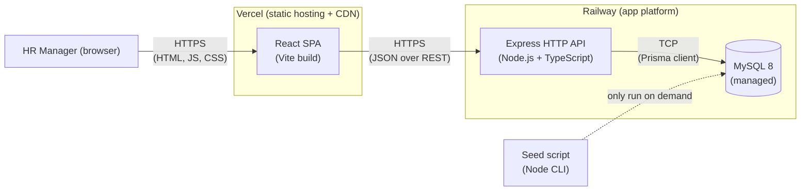
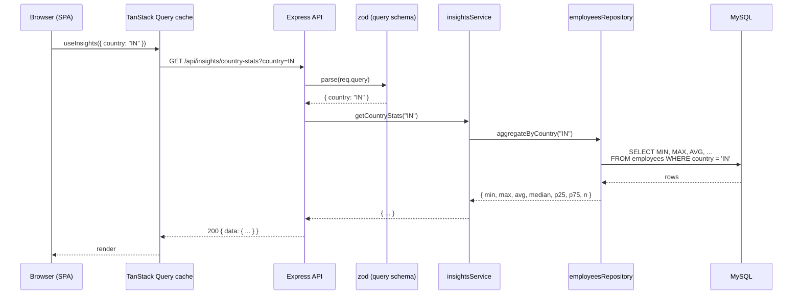
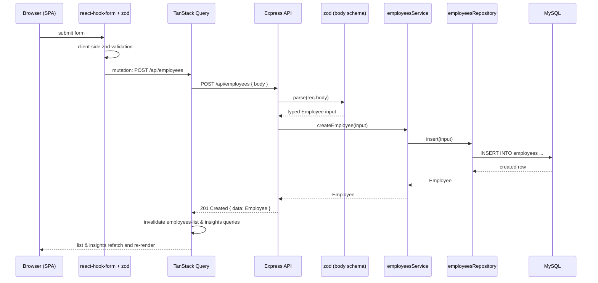
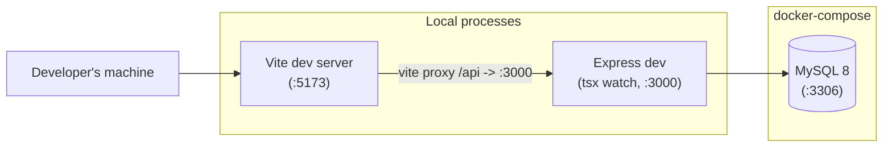
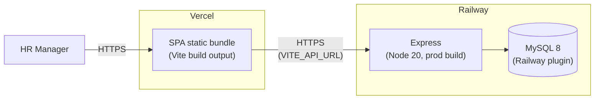

# 03 — Architecture

> **Purpose of this document.** This document moves us from *what* (requirements) and *who* (product thinking) to *how* the system is shaped. It captures the architectural style, the component boundaries, the request flow, the cross-cutting decisions that touch every feature (validation, errors, state, configuration, logging), and — importantly — the alternatives we considered and rejected, with reasons. The *data model* and *API contracts* get their own documents next; this one stays at the level of "boxes, lines, and the rules that govern them."

---

## 1. Architectural style — and why

This is a **classic three-tier client / API / database monolith**, with the frontend deployed independently from the backend.

The reasoning, in order of weight:

1. **The problem is shaped like a monolith.** A single user persona, one tenant, ~10,000 rows, request-response interactions only. There is no event-driven, multi-tenant, or high-write-fanout workload here. A monolith is *the* right answer; anything else would be solving a problem we don't have.
2. **The reviewer is the second customer.** A reviewer should be able to clone, run, and reason about the whole system in fifteen minutes. A monolith reads top-to-bottom; a distributed system reads sideways across services. The simpler shape is also the more honest one for this scope.
3. **Independent frontend deployment is realistic.** Real internal HR tools at this size deploy the UI to a CDN-backed static host (Vercel, Netlify, Cloudfront-S3) and the API to an app platform (Railway, Fly, ECS). Keeping the two separate from the start avoids the trap of "we'll split it later" and matches what the deployed reference architecture would look like in production.
4. **It preserves optionality.** Because the boundaries between layers are clean (see §6), the backend service can be extracted, the database can be swapped, or a second consumer (a mobile app, a CSV exporter, an internal Slack bot) can be added without rewriting anything.

We are **not** adopting microservices, an event bus, CQRS, GraphQL, or server components. Each of those rejections is justified in §9.

---

## 2. System context — the one-screen view



Three runtime components plus a one-shot CLI tool. That's the whole picture.

---

## 3. Components

### 3.1 Frontend — React SPA (Vite)

A single-page application built with Vite, written in TypeScript, styled with Tailwind, and built from shadcn/ui primitives.

- **Why an SPA, not Next.js?** No SEO requirement, no marketing pages, a single trusted user. The two routes (`/employees`, `/insights`) are both behind the same shell. Next.js's server-side rendering, app router, and React Server Components add complexity that does not pay back for this persona. We get faster cold builds, simpler routing, and a deployment that is literally a folder of static files.
- **Server-state management:** **TanStack Query** (formerly React Query). It owns caching, invalidation, retries, and the "writes immediately update the list" guarantee from product principle #4. We pair this with `react-hook-form` + a `zod` resolver for form state. We do **not** introduce Redux, Zustand, or Jotai — there is no global *client* state worth managing.
- **Routing:** `react-router-dom` v6, two top-level routes. No deep nesting; the IA in [`02-product-thinking.md`](02-product-thinking.md) §5 is two tabs.
- **API client:** A thin wrapper around `fetch` with typed return shapes derived from the same `zod` schemas used by the backend (shared via a `packages/shared` directory — see §6.3). No `axios`; the standard `fetch` is sufficient and avoids a dependency.

### 3.2 Backend — Express HTTP API (Node + TypeScript)

A single Express application exposing a small REST surface. The detailed endpoint list lives in [`05-api-design.md`](05-api-design.md); here we describe the *shape* of the service, not its contracts.

Internally, the backend has four well-separated layers:

| Layer | Responsibility | What it knows | What it does **not** know |
|---|---|---|---|
| **Routes** (`src/routes/*`) | Parse HTTP, validate input with `zod`, call a service, format the response, surface errors. *Thin.* | HTTP, JSON, request/response shapes | Domain logic, SQL, Prisma |
| **Services** (`src/services/*`) | Domain logic — the meaningful work. Insights aggregations, business rules, orchestration of repository calls. | Domain types, repository functions | HTTP, Express, JSON shape |
| **Repository** (`src/repositories/*`) | All database access through Prisma. One module per aggregate. | Prisma client, schema | HTTP, business rules |
| **Schemas** (`src/schemas/*`) | `zod` schemas for every request and every persisted entity. Single source of truth for shapes; TypeScript types are inferred from them, not declared twice. | Field rules, validation | Anything else |

A few cross-layer concerns sit alongside:

- **Middleware** (`src/middleware/*`): a single error handler, request-id injection, request logging.
- **DB client** (`src/db/prisma.ts`): a singleton Prisma client with sensible connection-pool settings.
- **Config** (`src/config.ts`): typed, validated `env` parsing — fails fast on startup if a required variable is missing.

### 3.3 Database — MySQL 8

A managed MySQL 8 instance, accessed through Prisma. The schema lives in `prisma/schema.prisma`; migrations are checked in.

- **Why MySQL** is captured in [`04-data-model.md`](04-data-model.md) §1 and [`08-tradeoffs.md`](08-tradeoffs.md).
- **Connection pooling** is handled by the Prisma client; we keep the pool small (default 5) since the workload is single-user and we don't want to exhaust Railway's connection budget.
- **Indexes** are designed against the actual query shapes we will run — see [`07-performance-plan.md`](07-performance-plan.md). We do not index speculatively.

### 3.4 Seed script — Node CLI

The seed script is **not** an HTTP endpoint and **not** part of the API. It is a separately-invocable CLI (`npm run seed`) that:

1. Reads `first_names.txt` and `last_names.txt` from disk into memory once.
2. Connects to the database via the same Prisma client used by the API.
3. Optionally truncates `employees` (guarded behind an explicit flag).
4. Generates 10,000 employees and inserts them in batched, transaction-wrapped `INSERT` statements.

Performance design and benchmarks live in [`07-performance-plan.md`](07-performance-plan.md). The architectural point here is that **the seed script and the API never share request-handling code** — they share only the data layer.

---

## 4. The request flow

A representative read and a representative write, end-to-end.

### 4.1 Read — "show me the salary insights for country = IN"



### 4.2 Write — "add a new employee"



The two ideas worth highlighting from these flows:

- **Validation happens twice — once on each side of the wire.** The client-side validation is a UX courtesy. The server-side `zod.parse` is the *real* enforcement. Both use the same schema (see §6.3).
- **Cache invalidation is explicit, not magical.** When a mutation succeeds, the client invalidates the *specific* queries that the mutation could have affected (`employees-list`, `country-stats`, etc.). This implements design principle #4 (writes are immediately visible) without resorting to polling.

---

## 5. Deployment topology

### 5.1 Local development



- One Docker Compose file at the repo root spins up MySQL. Reviewer runs `docker compose up -d` once.
- The Vite dev server proxies `/api/*` to the Express dev server, so there are no CORS gymnastics during development.
- Both `npm run dev` commands run with hot reload.

### 5.2 Production



- The SPA reads `VITE_API_URL` at build time and points to the Railway-issued backend URL.
- The backend reads `DATABASE_URL` from Railway's env and is on the same private network as MySQL.
- CORS is configured to allow the Vercel origin only.
- A `release` step on the backend runs `prisma migrate deploy` before the new container takes traffic.

---

## 6. Cross-cutting decisions

These are the rules that apply across every feature. They are written down here so we don't re-decide them in every PR.

### 6.1 Validation

- Every external boundary (every HTTP body, query string, and path param) is validated by a `zod` schema **before** any service code runs.
- TypeScript types for the parsed shapes are *inferred from* the `zod` schema (`z.infer<typeof schema>`), never declared separately. There is exactly one source of truth per shape.
- The same `zod` schemas are shared with the frontend in `packages/shared` (see §6.3), so the form on the client and the parser on the server cannot drift.

### 6.2 Error model

- Every API error response is a structured JSON object: `{ error: { code: string, message: string, details?: unknown } }`.
- Codes are stable strings (`VALIDATION_FAILED`, `NOT_FOUND`, `CONFLICT`, `INTERNAL`).
- HTTP status codes follow REST conventions (400, 404, 409, 422, 500).
- A single Express error-handling middleware converts thrown errors (including `zod` parse errors) into this shape. Route handlers never write error responses by hand.

### 6.3 Code-sharing between client and server

- A small shared TypeScript package (`packages/shared`) contains: `zod` schemas, inferred types, and a few pure helpers (e.g. `formatSalary`, `parseCountryCode`).
- Backend and frontend both import from `@app/shared`.
- This prevents "the frontend says salary is a string, the backend expects a number" bugs at build time, not at runtime.

### 6.4 Configuration

- All configuration is read through a single `config` module that parses `process.env` with `zod` at process start.
- A missing or malformed required variable is a startup failure with a useful error message, not a runtime surprise.
- `.env.example` is checked in. Real `.env` files are git-ignored.

### 6.5 Logging

- Backend uses `pino` for structured JSON logs.
- Each request gets a `requestId` header (echoed in responses) which is included in every log line for that request.
- We do not log salaries or full employee records at INFO level — only IDs and the operation. This is documented in the code.

### 6.6 Testing

The testing approach is its own document, [`06-tdd-strategy.md`](06-tdd-strategy.md), but the architectural commitment is:

- Services are pure-enough to be **unit-tested in isolation** with no DB and no Express.
- Routes are **integration-tested** end-to-end against a real MySQL (the same `docker compose` MySQL, using a `_test` database with per-test transactional rollback).
- The frontend has component tests for the non-trivial pieces (forms, the table, the insights panel).

### 6.7 Frontend state

- Server state lives only in **TanStack Query**. We do not duplicate server data into a Redux/Zustand store.
- Form state lives in **react-hook-form**.
- UI state (open dialogs, selected row) lives in **component-local React state**.
- There is no global client-state library.

---

## 7. Repository layout

```
employee-salary-analytics/
├── docker-compose.yml
├── package.json                  # workspaces root
├── packages/
│   └── shared/                   # zod schemas + inferred types + tiny helpers
│       ├── src/
│       │   ├── schemas/
│       │   ├── types/
│       │   └── helpers/
│       └── package.json
├── backend/
│   ├── prisma/
│   │   ├── schema.prisma
│   │   ├── migrations/
│   │   ├── first_names.txt
│   │   ├── last_names.txt
│   │   └── seed.ts
│   ├── src/
│   │   ├── server.ts             # Express bootstrap
│   │   ├── config.ts             # env parsing
│   │   ├── db/prisma.ts          # client singleton
│   │   ├── middleware/
│   │   ├── routes/
│   │   ├── services/
│   │   └── repositories/
│   ├── tests/
│   │   ├── unit/                 # services (pure)
│   │   └── integration/          # routes + DB
│   └── package.json
├── frontend/
│   ├── src/
│   │   ├── main.tsx
│   │   ├── App.tsx
│   │   ├── routes/
│   │   ├── components/
│   │   ├── features/
│   │   │   ├── employees/
│   │   │   └── insights/
│   │   ├── lib/                  # api client, hooks
│   │   └── styles/
│   ├── tests/
│   └── package.json
└── docs/
    └── 01..N-*.md
```

A few things to notice:

- A **monorepo with workspaces**, not three independent repos. The shared `zod` schemas are the reason — they need to be one source of truth.
- The backend has a clear `routes` / `services` / `repositories` / `schemas` split that matches §3.2.
- The frontend organises by **feature** (`features/employees`, `features/insights`), not by type (`components/`, `hooks/`). Feature-folders are easier to reason about as the codebase grows.

---

## 8. Non-functional architecture notes

| Concern | How the architecture addresses it |
|---|---|
| **Latency at 10K rows** (target: <300 ms p95 for any insight) | Indexes on `country`, `(country, jobTitle)`; aggregates done in SQL, not in app code; no N+1; TanStack Query cache for the common case. Detailed plan in [`07-performance-plan.md`](07-performance-plan.md). |
| **Seed performance** | Single transaction, batched parameterised `INSERT`s (≥1,000 per statement), name files loaded once. Detailed plan in [`07-performance-plan.md`](07-performance-plan.md). |
| **Determinism in tests** | Each test starts a Prisma transaction and rolls it back; no shared state between tests. No reliance on real time (`Date.now` is wrapped where it matters). Detailed plan in [`06-tdd-strategy.md`](06-tdd-strategy.md). |
| **Configuration drift between local and prod** | `.env.example` is the contract; both Docker Compose and Railway must define the same variables. `config.ts` is the only consumer. |
| **Schema evolution** | All changes go through Prisma migrations, which are checked in. The release step runs `prisma migrate deploy` before the new container takes traffic. |

---

## 9. Alternatives considered and rejected

| Alternative | Why we rejected it |
|---|---|
| **Next.js (App Router) instead of Vite + React** | No SEO need, no marketing pages, a single authenticated-by-trust user. The server-component / route-handler model couples the frontend and backend in a way that makes our independent Vercel + Railway deploy story harder to articulate and harder to test. Vite is faster to build, simpler to mentally model, and matches the "internal tool" shape better. |
| **tRPC instead of REST** | Compelling type-safety, but the brief implies REST and a reviewer evaluating "architectural decisions" should not need to learn project-specific RPC conventions to follow the code. We get most of tRPC's safety from shared `zod` schemas + inferred types, without giving up an HTTP-native contract. |
| **GraphQL** | We have ten endpoints, not a hundred, and a single client. GraphQL would buy us flexibility we will not use and add a server runtime, a schema language, and a client cache we already have via TanStack Query. |
| **Server-side rendering / React Server Components** | The persona is a logged-in HR Manager on a laptop. There is nothing for SEO to do and nothing to render before JavaScript loads that would not be empty anyway. SSR is added complexity for a benefit we cannot use. |
| **Microservices** | One bounded context, one team, ten thousand rows. Splitting it would be cosplay. |
| **An event bus / CQRS** | We have no eventual-consistency requirement and no second consumer of writes. The premise for CQRS is absent. |
| **Postgres instead of MySQL** | Both would be fine. The user explicitly chose MySQL, and Railway's MySQL plugin gives us a managed instance with zero setup. Captured in [`08-tradeoffs.md`](08-tradeoffs.md). |
| **SQLite instead of MySQL** | The brief gave SQLite as an example, but a real HR tool would not run on SQLite, and we want the architecture to be honest about that. Captured in [`08-tradeoffs.md`](08-tradeoffs.md). |
| **An ORM other than Prisma (TypeORM, Drizzle, Kysely)** | Prisma's migration story is the strongest in the Node ecosystem, its query API is type-safe end-to-end, and its `executeRaw` escape hatch covers the cases (the seed script) where the ORM would be too slow. The alternatives are reasonable but each gives up something we want. |
| **Mocking the database in tests** | Mocks lie. We run integration tests against the *same* MySQL we deploy to (per test transactions, rolled back). Unit tests use plain functions, not DB mocks, because we keep services pure. |

---

## 10. The architectural commitments, restated

If a future change tries to violate any of these, we re-open this document instead of silently breaking the rule.

1. The backend has **four internal layers** (routes, services, repositories, schemas) and they do not skip each other.
2. **Validation happens at every external boundary**, with `zod`, using a schema also shared with the frontend.
3. **Writes invalidate the specific queries they affect** — never a blunt "refetch everything."
4. **Errors leave the API in one shape** (`{ error: { code, message, details? } }`) — route handlers never hand-roll error responses.
5. **Configuration is parsed once, at startup, and the process refuses to start if it is wrong.**
6. **Services are pure-enough to unit-test without HTTP or DB**; integration tests cover the wiring.
7. **The seed script and the API share the data layer and nothing else.**

---

## 11. What we do next

With the system shape settled, the next document — [`04-data-model.md`](04-data-model.md) — fills in the most important interior detail: what an "employee" actually looks like in the database, why each field is there, which indexes we are adding, and how the data layer answers the persona's questions efficiently.
